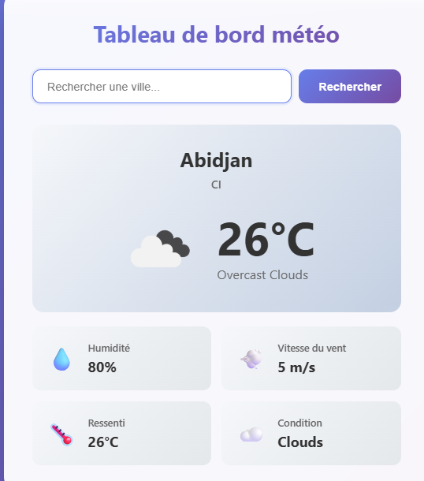

# Weather_App_React

## Description
Application web développée avec React permettant d'obtenir les informations météorologiques d'une ville en temps réel grâce à une API météo.

Ce projet est le **quarante-et-unième** du défi personnel **100 projets en 2026** et marque le début de l'apprentissage de React.

---

## Objectifs du projet

- Découvrir React
- Utiliser les Hooks (`useState`, `useEffect`)
- Consommer une API REST
- Manipuler des données JSON
- Structurer une application en composants

---

## Plateforme

- Web (navigateur)

---

## Technologies utilisées

- React
- Vite
- CSS
- OpenWeatherMap API

---

## Fonctionnalités

- Recherche d'une ville
- Affichage de la température
- Affichage du ressenti
- Affichage de l'humidité
- Affichage du vent
- Icône météo
- Gestion des erreurs
- État de chargement

---

## Design & UX

- Interface moderne
- Carte météo centrale
- Recherche rapide
- Responsive mobile et desktop
- Affichage clair des données

---

## Captures d’écran

---

## Ce que j’ai appris

- Création de composants React
- Utilisation de useState
- Utilisation de useEffect
- Consommation d'API avec fetch
- Gestion des états de chargement et d'erreur

---

## Améliorations possibles

- Prévisions sur 5 jours
- Géolocalisation
- Historique des recherches
- Mode sombre
- Fond dynamique selon la météo

---

## Statut du projet

**Projet terminé**